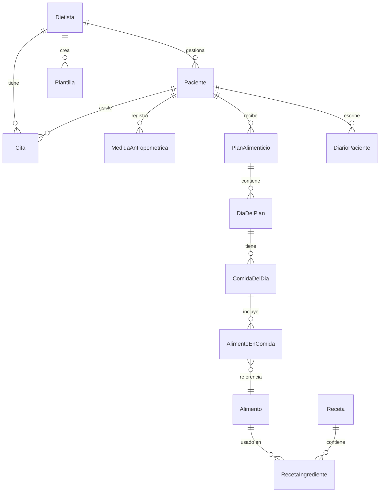

# App de Nutrición para Dietistas - Plan Completo

## Stack Tecnológico Recomendado

- **Frontend**: Next.js 14 (App Router) + TypeScript + Tailwind CSS + shadcn/ui
- **Backend**: Next.js API Routes + Server Actions
- **Base de datos**: PostgreSQL vía Supabase (auth + DB + storage)
- **ORM**: Prisma
- **IA**: OpenAI API (GPT-4) para generación de dietas y asistente
- **Gráficos**: Recharts
- **PDF**: react-pdf para exportar dietas/informes
- **Despliegue**: Vercel (frontend) + Supabase (backend)

---

## Funcionalidades Principales

### 1. Autenticación y Roles

- Login/registro para **dietistas** (cuenta principal)
- Portal simplificado para **pacientes** (acceso con enlace o credenciales)
- Perfil profesional del dietista (datos, especialidad, logo)

### 2. Dashboard del Dietista

- Resumen de pacientes activos
- Citas del dia / semana
- Pacientes pendientes de revision de dieta
- Alertas (pacientes que no registran peso, dietas por vencer, etc.)
- Graficos de actividad y rendimiento

### 3. Gestion de Pacientes

- **Ficha completa del paciente**:
  - Datos personales, contacto
  - Historial medico (patologias, medicamentos)
  - Alergias e intolerancias alimentarias
  - Objetivos (perder peso, ganar masa, mantenimiento, patologia)
  - Preferencias alimentarias (vegetariano, vegano, sin gluten, etc.)
- **Medidas antropometricas** con evolucion temporal:
  - Peso, altura, IMC
  - Porcentaje de grasa corporal, masa muscular
  - Perimetros (cintura, cadera, brazo, etc.)
  - Graficos de evolucion
- **Historial de consultas**: notas clinicas por cada visita

### 4. Base de Datos de Alimentos

- Integracion con **API de BEDCA** (Base de Datos Espanola de Composicion de Alimentos) y/o **Open Food Facts**
- Informacion por cada alimento:
  - Macronutrientes (proteinas, carbohidratos, grasas, fibra)
  - Micronutrientes (vitaminas, minerales)
  - Calorias por 100g y por porcion
- **Alimentos personalizados**: el dietista puede agregar alimentos propios
- **Recetas**: combinacion de alimentos con calculo automatico de valores nutricionales
- Busqueda avanzada con filtros (por macro, tipo de alimento, sin alergenos, etc.)

### 5. Creacion de Dietas / Planes Alimenticios (CORE)

- **Editor visual tipo calendario semanal**:
  - Columnas = dias de la semana
  - Filas = comidas del dia (desayuno, media manana, comida, merienda, cena, resopon)
  - Drag & drop de alimentos y recetas
- **Calculo automatico en tiempo real**: calorias totales, macros por comida y por dia
- **Barra de progreso nutricional**: indica si se cumplen los objetivos del paciente
- **Plantillas reutilizables**: guardar dietas como plantillas para aplicar a otros pacientes
- **Alternativas equivalentes**: sugerir intercambios de alimentos con perfil nutricional similar
- **Lista de la compra automatica**: generada a partir del plan semanal
- **Multiples planes**: un paciente puede tener varios planes (ej. entre semana vs fin de semana)
- **Versionado de dietas**: historial de cambios en la dieta del paciente

### 6. Asistente con Inteligencia Artificial

- **Generacion automatica de dietas**: el dietista indica los objetivos y restricciones, la IA genera un borrador de plan semanal completo
- **Sugerencias inteligentes**: al agregar un alimento, sugiere complementos para equilibrar macros
- **Analisis nutricional**: la IA revisa una dieta y sugiere mejoras
- **Chatbot asistente**: responde dudas sobre nutricion, calcula equivalencias, sugiere recetas

### 7. Metricas y Reportes

- **Evolucion del paciente**: graficos de peso, IMC, % grasa a lo largo del tiempo
- **Adherencia**: registro de si el paciente sigue la dieta (el paciente marca en su portal)
- **Informes en PDF**:
  - Dieta semanal formateada para imprimir
  - Informe de evolucion del paciente
  - Lista de la compra
- **Estadisticas del dietista**: numero de pacientes, dietas creadas, tasa de retencion

### 8. Compartir Dieta con el Paciente

- **Portal del paciente** (vista de solo lectura, acceso con enlace unico o credenciales simples):
  - Ver su dieta semanal actual
  - Ver su lista de la compra
  - Ver su evolucion (graficos de peso, medidas)
- **Exportar dieta como PDF**: para enviar por email o WhatsApp
- **Diario del paciente**: el paciente puede registrar lo que come realmente (comparar con la dieta planificada)

### 9. Agenda y Citas

- **Calendario** de citas con vista diaria/semanal/mensual
- **Recordatorios automaticos** por email
- **Notas por consulta**: el dietista anota observaciones en cada visita
- **Vinculacion con la ficha**: cada cita se asocia a un paciente

---

## Arquitectura de la Base de Datos (principales entidades)




---

## Estructura del Proyecto

```
AppNutricion/
  prisma/
    schema.prisma
  src/
    app/
      (auth)/            -- login, registro
      (dashboard)/       -- layout principal del dietista
        dashboard/       -- vista general
        pacientes/       -- CRUD pacientes
        dietas/          -- editor de dietas
        alimentos/       -- base de datos de alimentos
        recetas/         -- gestion de recetas
        agenda/          -- calendario de citas
        compartir/       -- compartir dietas con pacientes
        reportes/        -- metricas y PDF
        ajustes/         -- configuracion perfil
      (paciente)/        -- portal del paciente
        mi-dieta/
        mi-progreso/
        diario/
        mi-lista-compra/
      api/
        ai/              -- endpoints de IA
        alimentos/       -- API de alimentos
        ...
    components/
      ui/                -- shadcn components
      dieta/             -- componentes del editor de dietas
      paciente/          -- componentes de ficha paciente
      charts/            -- graficos reutilizables
    lib/
      prisma.ts
      supabase.ts
      openai.ts
      utils.ts
    types/
```

---

## Fases de Desarrollo

### Fase 1 - Fundamentos (semanas 1-2)

- Setup del proyecto (Next.js + Prisma + Supabase)
- Autenticacion (registro/login dietista)
- Dashboard basico
- CRUD de pacientes con ficha completa

### Fase 2 - Core de Dietas (semanas 3-5)

- Base de datos de alimentos (integracion API + personalizados)
- Sistema de recetas
- Editor visual de planes alimenticios (drag & drop)
- Calculo automatico de macros/calorias
- Plantillas reutilizables

### Fase 3 - Seguimiento (semanas 6-7)

- Medidas antropometricas con graficos de evolucion
- Historial de consultas
- Agenda y citas
- Generacion de PDF

### Fase 4 - IA y Comunicacion (semanas 8-10)

- Generacion de dietas con IA
- Sugerencias inteligentes
- Portal del paciente (ver dieta, evolucion, lista de compra)
- Diario alimentario del paciente
- Exportar y compartir dieta via enlace o PDF

### Fase 5 - Pulido y Metricas (semanas 11-12)

- Dashboard con metricas avanzadas
- Estadisticas del dietista
- Notificaciones
- Optimizacion y testing
- Preparar para despliegue

